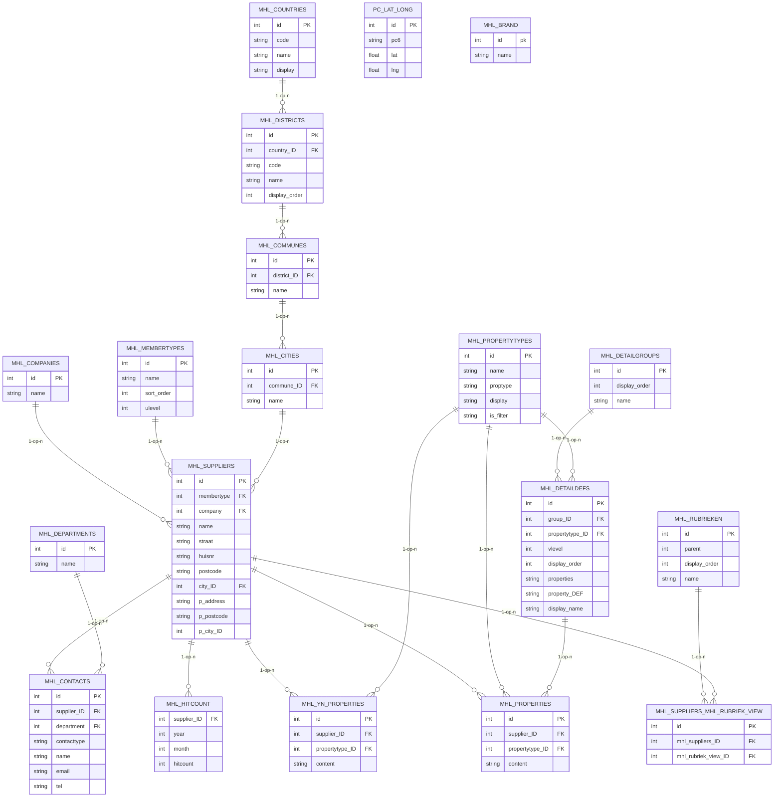

```mermaid
erDiagram
    MHL_COUNTRIES {
        int id PK
        string code
        string name
        string display
    }
    MHL_DISTRICTS {
        int id PK
        int country_ID FK
        string code
        string name
        int display_order
    }
    MHL_COMMUNES {
        int id PK
        int district_ID FK
        string name
    }
    MHL_CITIES {
        int id PK
        int commune_ID FK
        string name
    }
    PC_LAT_LONG {
        int id PK
        string pc6
        float lat
        float lng
    }

    MHL_COMPANIES {
        int id PK
        string name
    }
    MHL_SUPPLIERS {
        int id PK
        int membertype FK
        int company FK
        string name
        string straat
        string huisnr
        string postcode
        int city_ID FK
        string p_address
        string p_postcode
        int p_city_ID 
    }
    MHL_CONTACTS {
        int id PK
        int supplier_ID FK
        int department FK
        string contacttype
        string name
        string email
        string tel
    }
    MHL_DEPARTMENTS {
        int id PK
        string name
    }
    MHL_HITCOUNT {
        int supplier_ID FK
        int year
        int month
        int hitcount
    }

    MHL_MEMBERTYPES {
        int id PK
        string name
        int sort_order
        int ulevel
    }

    MHL_PROPERTIES {
        int id PK
        int supplier_ID FK
        int propertytype_ID FK
        string content
    }
    MHL_YN_PROPERTIES {
        int id PK
        int supplier_ID FK
        int propertytype_ID FK
        string content
    }
    MHL_PROPERTYTYPES {
        int id PK
        string name
        string proptype
        string display
        string is_filter
    }

    MHL_DETAILGROUPS {
        int id PK
        int display_order
        string name
    }
    MHL_DETAILDEFS {
        int id PK
        int group_ID FK
        int propertytype_ID FK
        int vlevel
        int display_order
        string properties
        string property_DEF
        string display_name
    }

    MHL_RUBRIEKEN {
        int id PK
        int parent 
        int display_order
        string name
    }
    MHL_SUPPLIERS_MHL_RUBRIEK_VIEW {
        int id PK
        int mhl_suppliers_ID FK
        int mhl_rubriek_view_ID FK
    }
    MHL_BRAND{
        int id pk
        string name 
    }

    MHL_COUNTRIES ||--o{ MHL_DISTRICTS : "1-op-n"
    MHL_DISTRICTS ||--o{ MHL_COMMUNES : "1-op-n"
    MHL_COMMUNES ||--o{ MHL_CITIES : "1-op-n"
    

    MHL_COMPANIES ||--o{ MHL_SUPPLIERS : "1-op-n"
    MHL_MEMBERTYPES ||--o{ MHL_SUPPLIERS : "1-op-n"
    MHL_CITIES ||--o{ MHL_SUPPLIERS : "1-op-n"
    MHL_SUPPLIERS ||--o{ MHL_CONTACTS : "1-op-n"
    MHL_DEPARTMENTS ||--o{ MHL_CONTACTS : "1-op-n"
    MHL_SUPPLIERS ||--o{ MHL_HITCOUNT : "1-op-n"

 MHL_SUPPLIERS ||--o{MHL_YN_PROPERTIES : "1-op-n"
    MHL_SUPPLIERS ||--o{ MHL_PROPERTIES : "1-op-n"
    MHL_PROPERTYTYPES ||--o{ MHL_PROPERTIES : "1-op-n"
    MHL_PROPERTYTYPES ||--o{ MHL_YN_PROPERTIES : "1-op-n"

    MHL_DETAILGROUPS ||--o{ MHL_DETAILDEFS : "1-op-n"
    MHL_PROPERTYTYPES ||--o{ MHL_DETAILDEFS : "1-op-n"

    MHL_RUBRIEKEN ||--o{ MHL_SUPPLIERS_MHL_RUBRIEK_VIEW : "1-op-n"
    MHL_SUPPLIERS ||--o{ MHL_SUPPLIERS_MHL_RUBRIEK_VIEW : "1-op-n"
    MHL_DETAILDEFS ||--o{ MHL_PROPERTIES : "1-op-n"
```
 